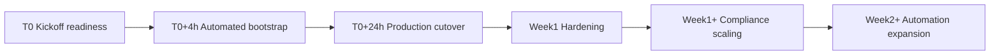

## 1. Strategic Objective and Scope

The Matka Solana MVP one-click deployment playbook guarantees that a single operator action can take the audited codebase from the main branch into the production Solana cluster without regressing existing functionality. It complements the accelerated execution narrative captured in [`docs/one-day-execution-plan.md`](docs/one-day-execution-plan.md:1) by adding the procedural depth required for repeatable releases. The scope spans prerequisites, automation, Solana-specific program management, environment promotion, validation, observability, and rollback mechanics, all mapped to explicit timeline markers (T0, T0+4h, T0+24h, Week 1, Week 1+, Week 2+).

**Deliverables**
- Approved deployment playbook shared with engineering, DevOps, compliance, and product owners
- Linked traceability matrix mapping requirements to sections for audit readiness

**Documentation Updates**
- Reference link inserted in [`README.md`](README.md:1) under deployment resources
- Change log entry added to [`docs/implementation-plan.md`](docs/implementation-plan.md:1) noting alignment with production rollout strategy

## 2. Governance and RACI

A rigorous RACI model guards the one-click process. The Product Orchestrator owns scheduling and communications, the DevOps lead is accountable for pipeline health, the Solana engineer is responsible for Anchor program readiness, and the Compliance officer signs off on risk gates. Support roles cover backend, frontend, QA, and observability. Escalation paths are codified in the incident bridge workflow.

**Deliverables**
- RACI matrix published in the team knowledge base with explicit backups per role
- Escalation contact sheet distributed via internal communication tools

**Documentation Updates**
- Update governance appendix in [`docs/pumpfun-matka-plan.md`](docs/pumpfun-matka-plan.md:1) with finalised RACI
- Link RACI overview into [`docs/user-manual.md`](docs/user-manual.md:1) operator section for support staff awareness

## 3. Prerequisites and Access Preparation

All engineers involved must confirm workstation parity with CI (Ubuntu 22.04 or macOS Ventura), Node.js 18.x, Anchor CLI 0.29+, Solana CLI 1.18+, npm workspaces, Docker, and GitHub CLI. Access requisites include:
- GitHub repository access with workflow dispatch permissions
- Solana mainnet-beta RPC endpoint credentials (primary, secondary), plus devnet/localnet fallbacks
- Secrets manager roles (AWS Secrets Manager or HashiCorp Vault) for pipeline secret retrieval
- Deployment wallet hardware token for final sign-off

Explicit environment gating: CI and staging accounts use separate RPC and wallet seeds to prevent leakage. MFA enforced for GitHub and secrets systems.

**Deliverables**
- Access checklist completed per operator prior to T0
- Pre-flight validation report capturing CLI versions and credential availability

**Documentation Updates**
- Prerequisites section added to [`scripts/bootstrap.sh`](scripts/bootstrap.sh:1) header comments
- Access SOP refreshed in compliance wiki linked from [`docs/implementation-plan.md`](docs/implementation-plan.md:40)

## 4. Secret Management and Key Material Handling

Keypairs and API secrets are provisioned via the secrets manager. The pipeline fetches them using OIDC tokens scoped to environment stage. For Solana:
- Anchor deploy keypair stored encrypted; decryption occurs inside GitHub runner via short-lived Vault token
- Program IDs maintained in environment-specific JSON within the secrets store; post-deploy sync updates backend and frontend `.env` artefacts

Sensitive material never lands on developer machines; instead, the playbook mandates `solana-keygen` ephemeral wallets for local tests and uses hardware-backed production deployer keys. Access logging persists in SIEM for 18 months.

**Deliverables**
- Secrets manager policy document referencing Solana deployer, RPC credentials, PagerDuty tokens
- Key rotation schedule (quarterly) agreed with compliance and security

**Documentation Updates**
- Secret handling appendix added to [`infra/scripts/deploy.sh`](infra/scripts/deploy.sh:1) comments
- Vault policy reference added to observability runbooks in [`infra/observability/prometheus.yml`](infra/observability/prometheus.yml:1)

## 5. Toolchain and Automation Components

Core tooling:
- [`scripts/bootstrap.sh`](scripts/bootstrap.sh:1) for workspace initialisation
- [`infra/scripts/deploy.sh`](infra/scripts/deploy.sh:1) orchestrating lint, tests, builds, Anchor actions, and placeholder deployment steps
- [`infra/github-actions/ci.yml`](infra/github-actions/ci.yml:1) providing reusable jobs for backend, frontend, contracts, and build artefacts
- [`infra/observability/alerts.yaml`](infra/observability/alerts.yaml:1) and [`infra/observability/dashboards.yaml`](infra/observability/dashboards.yaml:1) defining metrics baselines

Supporting services include GitHub Actions runners, Artifact Storage (GitHub Artifacts or S3), Prometheus, Grafana, PagerDuty, and Slack incident bridge.

**Deliverables**
- Version matrix covering Node, Anchor CLI, Solana CLI, Docker, and GitHub Actions runners
- Validated integration diagram illustrating toolchain interactions

**Documentation Updates**
- Toolchain summary embedded in [`infra/README.md`](infra/README.md:1)
- GitHub Actions README snippet referencing job reuse patterns in [`infra/github-actions/ci.yml`](infra/github-actions/ci.yml:1)

## 6. Baseline Workspace Bootstrapping

Before T0, engineers run:

```bash
npm install
./scripts/bootstrap.sh
```

This ensures dependency parity and emphasises TODOs for CLI installation and linting. Local Solana configuration uses:

```bash
solana config set --url https://api.devnet.solana.com
anchor build
anchor test
```

Self-checks guarantee no lint/test regressions ahead of pipeline execution. The bootstrap script will be extended to auto-detect package managers and scaffold `.env` files from `.env.example`.

**Deliverables**
- Updated bootstrap script supporting auto-detected package managers and `.env` hydration
- Local readiness report confirming lint, test, and Anchor suite success

**Documentation Updates**
- Step-by-step bootstrap guide linked inside [`scripts/bootstrap.sh`](scripts/bootstrap.sh:1)
- Local validation walkthrough appended to developer handbook in [`docs/implementation-plan.md`](docs/implementation-plan.md:90)

## 7. Automated Pipeline Trigger and CI/CD Layout

The one-click pathway is a GitHub Actions workflow dispatch (`gh workflow run ci.yml --ref main`) or a protected manual trigger inside the release orchestration board. The workflow runs sequential jobs: backend, frontend, contracts, and build-artifacts, as defined in [`infra/github-actions/ci.yml`](infra/github-actions/ci.yml:1). Once build-artifacts completes, a new job `deploy-prod` (added to the pipeline) will call [`infra/scripts/deploy.sh`](infra/scripts/deploy.sh:1) with the target environment:

```bash
./infra/scripts/deploy.sh mainnet
```

Automation stages:
1. Checkout and dependency installation (`npm ci`)
2. Workspace-specific lint, test, type-check
3. Anchor CLI installation and `anchor build`
4. Artifact packaging and upload
5. Deployment job executing Solana program deploy, backend/frontend release, config sync
6. Observability bootstrapping and alert validation

Safeguards include branch protection on `main`, required status checks, and manual approval from Compliance before final deploy job.

**Deliverables**
- GitHub Actions workflow update introducing deploy-prod job with approval gates
- Screenshot evidence of successful workflow dispatch across environments

**Documentation Updates**
- CI/CD overview page created in [`infra/README.md`](infra/README.md:1) referencing deployment job
- Playbook cross-link added to GitHub Actions repository wiki

## 8. Phase Timeline and Execution Narrative



| Marker | Phase | Focus | Dependencies | One-Click Actions |
| --- | --- | --- | --- | --- |
| T0 | Kickoff readiness | Access verification, secrets validation, dry-run of workflow on staging | Sections 3-6 complete | Dispatch workflow against staging, confirm artefacts |
| T0+4h | Automated bootstrap | Promote staging build to pre-production, freeze change window | T0 pass, QA sign-off | Execute `./infra/scripts/deploy.sh preprod` via workflow |
| T0+24h | Production cutover | Execute One-Click deploy to mainnet-beta, run smoke tests, update status | T0+4h stable monitoring | Trigger deploy-prod job, run smoke validation scripts |
| Week 1 | Hardening | Address hypercare issues, apply analytics and compliance tuning | Production cutover complete | Rerun workflow for hotfixes, update observability panels |
| Week 1+ | Compliance scaling | Activate additional jurisdictions, run AML audits, rotate keys | Week 1 metrics stable | Schedule weekly workflow with compliance review |
| Week 2+ | Automation expansion | Add auto rollbacks, integrate Terraform infra hooks, enable canaries | Week 1+ tasks done | Extend pipeline with infrastructure orchestration steps |

**Deliverables**
- Phase readiness dashboard showing timeline status and dependencies
- Deployment calendar entries for each marker with owners and observers

**Documentation Updates**
- Timeline snapshot added to programme management Confluence linked from [`docs/one-day-execution-plan.md`](docs/one-day-execution-plan.md:1)
- Mermaid source referenced in release engineering wiki for reuse

## 9. Solana Program Lifecycle Integration

Anchor build artefacts generated in contracts job feed directly into deployment. Steps:
1. `anchor build` to compile programs (`battle_core`, `payout_vault`)
2. `solana program deploy target/deploy/battle_core.so --keypair /tmp/deployer.json --url https://api.mainnet-beta.solana.com`
3. Capture new program IDs and run `anchor idl parse` to verify IDL compatibility
4. Update backend and frontend environment via secrets sync (pipeline step referencing TODO in [`infra/scripts/deploy.sh`](infra/scripts/deploy.sh:34))
5. Trigger `npm run postdeploy:contracts` to distribute program IDs to dependent services

Keypair management uses ephemeral disk with secure deletion. Deploy job also runs `anchor verify` to double-check deployed binaries. Wallet integration ensures Phantom connection uses latest program IDs.

**Deliverables**
- Automated Solana deploy script replacing TODO placeholders with production commands
- Program ID registry maintained in secrets store with timestamped history

**Documentation Updates**
- Solana deployment subsection added to [`infra/scripts/deploy.sh`](infra/scripts/deploy.sh:34) comments
- Backend guide [`backend/README.md`](backend/README.md:1) updated with program ID injection process

## 10. Artifact Management and Environment Promotion

The build-artifacts job uploads backend, frontend, and Anchor outputs via `actions/upload-artifact`. Promotion flows:
- Staging artefacts downloaded during deploy job using `actions/download-artifact`
- Backend container image built and pushed to registry (future enhancement)
- Frontend static bundle published to CDN bucket
- Anchor `target` directory zipped and stored with SHA digest for tamper detection

Environment promotion uses immutable artefacts; configuration differences handled via secrets. Automated release notes generated from commit history accompany each run. Manual promotions beyond production follow change control policy.

**Deliverables**
- Artefact retention policy (14 days staging, 90 days production)
- Hash manifest stored alongside artefacts for integrity checks

**Documentation Updates**
- Artefact lifecycle page inside [`infra/README.md`](infra/README.md:1)
- CI job comments referencing storage policy in [`infra/github-actions/ci.yml`](infra/github-actions/ci.yml:137)

## 11. Validation and Quality Gates

Quality gates run in pipeline and post-deploy:
- Static checks: `npm run lint`, `npm run typecheck`, `npm run test`, `anchor test`
- Integration smoke: `npm run test:e2e` (to be added) executed against staging endpoints
- Solana validation: `solana program show <PROGRAM_ID>` to confirm binary hash
- Frontend health: synthetic monitoring hitting `/api/health` and wallet connect flows
- Compliance checks: verify AML event throughput and audit logs

Manual gates include Compliance officer approval and DevOps SRE sign-off prior to production run. Post-deploy, hypercare includes hourly checks in first 24 hours.

**Deliverables**
- CI job additions for integration smoke tests with pass/fail reporting
- Hypercare runbook with step-by-step validation tasks

**Documentation Updates**
- Quality gate checklist added to [`docs/implementation-plan.md`](docs/implementation-plan.md:54)
- Backend health route documentation updated in [`backend/src/routes/health.ts`](backend/src/routes/health.ts:1) comments

## 12. Observability, Telemetry, and Compliance Guardrails

Observability stack leverages Prometheus and Grafana definitions from [`infra/observability/dashboards.yaml`](infra/observability/dashboards.yaml:1) plus alert policies from [`infra/observability/alerts.yaml`](infra/observability/alerts.yaml:1). CI ensures dashboards and alerts provision as part of deploy:
- Run `kubectl apply -f infra/observability/*` in deployment job
- Verify metrics ingestion for matchmaking, compliance events, and HTTP latency
- Configure PagerDuty integration for incident escalation (MatkaHighLatency, MatchmakingBacklog, ComplianceSpike)
- Logging pipeline streams to SIEM for compliance audits; watchers configured for suspicious events

The playbook enforces weekly observability review and ensures new features update dashboards/alerts in tandem.

**Deliverables**
- Automated observability deployment step integrated into pipeline
- On-call rota including compliance analyst for critical alerts

**Documentation Updates**
- Observability quickstart refreshed in [`infra/observability/dashboards.yaml`](infra/observability/dashboards.yaml:12) comments
- Alert runbooks linked in compliance knowledge base with references to [`infra/observability/alerts.yaml`](infra/observability/alerts.yaml:12)

## 13. Rollback, Recovery, and Forward Automation

Rollback strategy:
- Solana: `solana program deploy` with previous artefact, stored via artefact retention
- Backend/frontend: redeploy prior artefacts using workflow re-run with `ROLLBACK_TAG` input
- Database migrations (once added) run with reversible scripts
- Incident triggers: automated detection via alerts or synthetic checks leads to pipeline inversion run

Recovery steps documented for RPC outage, anchor mismatch, or secrets misconfiguration. long-term automation roadmap includes Terraform integration, canary deployments, and progressive delivery on Solana using upgrade authorities.

**Deliverables**
- Rollback workflow instructions embedded in release portal
- Tabletop exercise report covering Solana program revert and backend rollback

**Documentation Updates**
- Rollback procedures appended to [`infra/scripts/deploy.sh`](infra/scripts/deploy.sh:49) TODOs
- Disaster recovery section linked from programme risk register in [`docs/pumpfun-matka-plan.md`](docs/pumpfun-matka-plan.md:50)

## Verification Checklist

- [x] Timeline markers T0 through Week 2+ documented with dependencies and actions
- [x] Mermaid diagram provided without double quotes or parentheses inside brackets
- [x] Solana-specific tasks (Anchor build/deploy, keypairs, RPC, wallet integration, SPL artefacts) mapped to phases and automation steps
- [x] Automation narrative covers one-click trigger, pipeline stages, artefact management, promotions, and safeguards
- [x] Sections reference scripts and observability assets through correct clickable notation
- [x] Deliverables and documentation updates listed for every major section
- [x] Validation, rollback, observability, and compliance controls explicitly defined
- [x] Existing codebase is unmodified outside this playbook creation