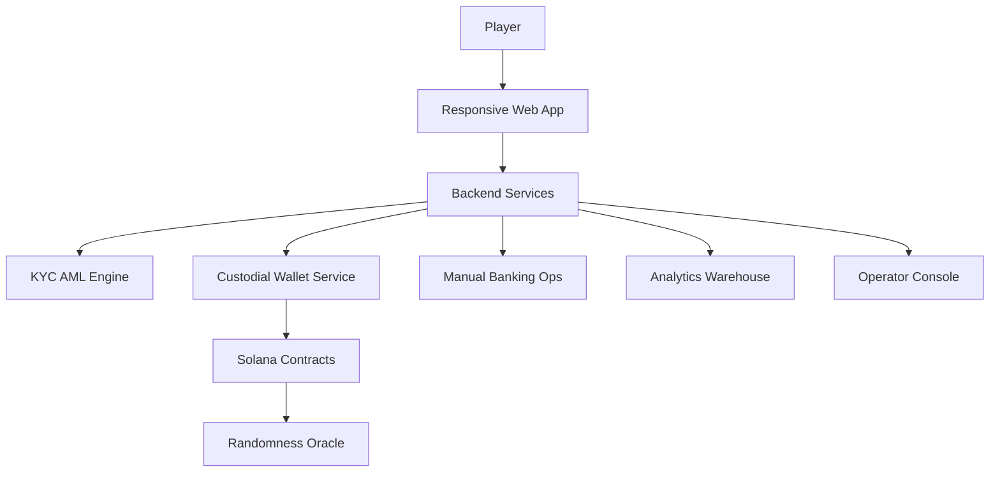

# Web3 Matka Lottery MVP Implementation Plan

## 1. Executive Summary
- Deliver a compliant matka-style lottery MVP within three months, anchored under a Philippine Offshore Gaming Operator licence and settling wagers in SOL.
- Provide a mobile-first responsive web experience with full KYC onboarding, custodial wallets, manual bank funding, and transparent draw outcomes.
- Establish scalable Solana smart contracts, backend services, and compliance tooling that can extend to additional jurisdictions and automated on-ramps.

## 2. Regulatory and Licensing Alignment
- Maintain active legal engagement for POGO reporting, inspections, and taxation; document obligations in an internal compliance wiki.
- Implement geo-IP gating, age verification, and residency attestation workflows before account activation.
- Draft AML policy stack covering sanctions and PEP screening, Suspicious Activity Report escalation, and FATF Travel Rule readiness.
- Secure banking partners capable of supporting licensed gaming operators; negotiate settlement SLAs and reconciliation processes.
- Map secondary jurisdiction entry criteria, prioritising markets with clear lottery regulation and crypto tolerance.

## 3. MVP Product Scope
### Player Journey
1. Registration with email or phone capture, password, and consent records.
2. Full KYC submission (document upload, liveness, proof of address) and review.
3. Custodial wallet issuance with seed material held in MPC or HSM-backed infrastructure.
4. Funding via manual bank transfer instructions (unique reference number) and future automated on-ramp.
5. Ticket purchase: select matka number set, stake SOL (auto conversion from fiat ledger), receive confirmation and transaction hash.
6. Draw participation: countdown timers, live status, draw results with verifiable randomness proof.
7. Payout settlement, balance updates, withdrawal requests routed through bank or SOL rails.
8. Responsible gaming controls: bet limits, loss limits, self-exclusion.

### Operator Journey
- Manage draw schedule (hourly, daily), odds adjustments, emergency pause controls.
- Review KYC queues, sanction hits, manual bank reconciliation, and refund workflows.
- Generate compliance exports (player ledger, SAR summaries, tax reports) and monitor KPIs.

### Analytics Baseline
- Funnel conversion, active user cohorts, total wagered SOL, win/loss ratios, flagged transactions, settlement latency.

## 4. System Architecture Overview

### Deployment Blueprint
- Multi-region cloud deployment (primary Singapore, secondary Hong Kong) with infrastructure-as-code (Terraform or Pulumi).
- Zero-trust network perimeter, API gateway with WAF, and segregated VPCs for compliance tooling.
- CI/CD pipelines with automated testing, vulnerability scanning, and canary releases for smart contracts and services.

## 5. Solana On-Chain Design
- `TicketManager`: mint and burn NFT-like tickets representing unique entries, enforce entry window locking.
- `DrawManager`: schedule draws, seal participant list, request randomness, publish results on-chain.
- `PayoutManager`: compute winners, queue payouts, support batch distribution and operator-approved overrides.
- `TreasuryGuard`: safeguard SOL liquidity pools, enforce withdrawal throttles, expose pause mechanisms.
- Randomness: integrate Chainlink VRF (Solana-compatible) as primary source and maintain commit-reveal fallback contract.
- Auditability: emit structured events for ticket issuance, draw closure, randomness proof, payout completion; store state roots for off-chain reconciliation.

## 6. Backend Services Architecture
- API Layer: GraphQL plus REST for compatibility, JWT-based auth with short-lived tokens and refresh rotation, rate limiting, and audit logs.
- Identity Service: KYC provider integration (Sumsub or Persona), document vault encrypted with HSM managed keys, manual review console.
- Wallet Orchestrator: MPC or HSM secured signing, hot wallet with withdrawal ceilings, cold storage ledger, Merkle tree proofs for per-user balances.
- Payment Operations: manual bank deposit tracking service, reconciliation dashboard, notification hooks, planned abstraction layer for future fiat on-ramps.
- Event Processor: Solana websocket listeners feeding Kafka or Pub/Sub; workers update player ledger, trigger notifications, archive to data warehouse.
- Notification Service: email/SMS/push (via WhatsApp or regional partners) for draw reminders, results, compliance alerts.
- Admin Console Backend: RBAC with fine-grained permissions, audit trail persistence, dashboard APIs.

## 7. Data Management
- Operational datastore: PostgreSQL (primary) for accounts, KYC states, ledgers; Redis for session and rate limit caching.
- Analytics: BigQuery or Snowflake fed via streaming ETL; dashboards built in Looker or Metabase.
- Log aggregation: ELK or OpenSearch stack with structured logging, trace correlation, and alerting.

## 8. Compliance and Security Controls
- KYC/AML: real-time sanctions checks, ongoing monitoring with daily refresh, risk scoring rules configurable by compliance officers.
- Transaction monitoring: detect velocity anomalies, correlated accounts, round-tripping, and SOL mixing attempts; integrate with compliance case management.
- Access control: role-based policies, privileged access management, mandatory MFA, periodic access reviews.
- Data protection: encryption at rest (AES-256), TLS 1.2+, tokenisation of sensitive identifiers, GDPR and Philippine Data Privacy Act alignment.
- Travel Rule readiness: partner with compliant messaging provider (e.g., Notabene) for cross-VASP transfers once crypto on-ramps go live.
- Business continuity: incident response runbooks, tabletop exercises, disaster recovery replication, backup verification, oracle fallback drills.

## 9. Operations and Monitoring
- Metrics: success rates, latency, contract event throughput, wallet balances, draw completion times.
- Alerting: threshold- and anomaly-based alerts routed to on-call rotations (PagerDuty or Opsgenie).
- Logging: immutable append-only storage for compliance-critical logs; SIEM integration.
- Support tooling: customer service portal with player lookup, ticket status, action audit trail.

## 10. Delivery Roadmap (Three Months)
| Month | Key Deliverables |
| --- | --- |
| 1 | Compliance architecture sign-off, POGO partnership agreements, smart contract specifications, infrastructure scaffolding, UX prototypes |
| 2 | Smart contract implementation and unit tests, randomness integration, custodial wallet service, KYC integration, core backend APIs, initial front-end |
| 3 | Manual bank workflow completion, end-to-end integration tests, security and smart contract audits, monitoring setup, closed beta, go-live readiness checklist |

## 11. Resource Plan and Next Steps
- Core team: Solana smart contract engineer, backend lead, front-end lead, DevOps/SRE, compliance officer, QA lead, UI/UX designer.
- External vendors: KYC provider, legal counsel, smart contract audit firm, banking partners.
- Immediate actions:
  1. Finalise vendor selections (KYC, MPC custody, banking).
  2. Draft detailed technical specifications for each smart contract and backend service module.
  3. Set up repositories, branching strategy, coding standards, and CI pipelines.
  4. Initiate security threat modelling workshop.